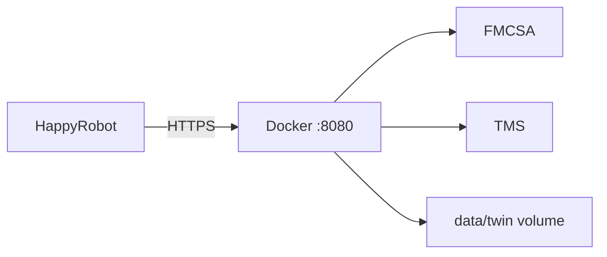

# Architecture details

## Components

| Component | Role |
|-----------|------|
| **HappyRobot Voice** | Inbound call UX, tool orchestration, SMS |
| **Integration API** (`backend/`) | Single proxy for FMCSA, TMS, OTP, negotiation, logging |
| **FMCSA** | MC authority verification (REST) |
| **Legacy TMS** | Load search, detail, booking (TCP) |
| **Twin (POC)** | JSON call logs in `backend/data/twin/` |
| **Ops dashboard** | Static UI → `/ops/calls`, `/ops/kpis` |

HappyRobot uses **one base URL** and **one API key**. FMCSA/TMS secrets stay on the server.

## API endpoints (`/api/v1`)

| Tool | Method | Path |
|------|--------|------|
| Catalog | GET | `/api/v1` |
| `create_session` | POST | `/api/v1/create_session` |
| `verify_carrier` | POST | `/api/v1/verify_carrier` |
| `lookup_carrier` | GET | `/api/v1/carriers/:mc_number` |
| `send_otp` | POST | `/api/v1/send_otp` |
| `verify_otp` | POST | `/api/v1/verify_otp` |
| `find_available_loads` | POST | `/api/v1/find_available_loads` |
| `get_load_detail` | GET | `/api/v1/loads/:load_id` |
| `negotiate_rate` | POST | `/api/v1/negotiate_rate` |
| `book_load` | POST | `/api/v1/book_load` |
| `transfer_to_colleague` | POST | `/api/v1/transfer_to_colleague` |
| `log_call` | POST | `/api/v1/log_call` |

**Auth:** `Authorization: Bearer <API_KEY>` or `X-API-Key: <API_KEY>`

## Policy (server-enforced)

- OTP required before load search or negotiation
- `max_rate` never returned to carriers
- Max 3 negotiation counter rounds
- Fresh TMS status check before booking

## POC storage

| Data | POC | Production target |
|------|-----|-------------------|
| Sessions | In-memory | Redis |
| OTP | In-memory | Redis (hashed) |
| Call logs | JSON files | Postgres + Twin |
| TMS cache | In-memory (45s) | Redis (optional) |

## Deployment



```bash
cd backend && cp .env.example .env && docker compose up --build -d
```

See [../README.md](../README.md) for full deploy steps.

## Repository layout

```text
backend/           Integration API (deploy this)
workflow/          Voice agent prompt
Architecture/      This folder
apps/ops-dashboard/  Ops UI
docs/              Submission documents
```
