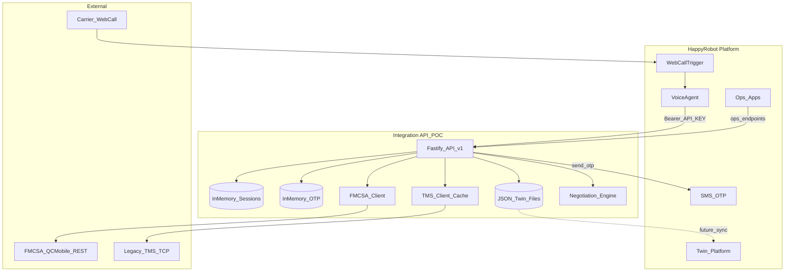
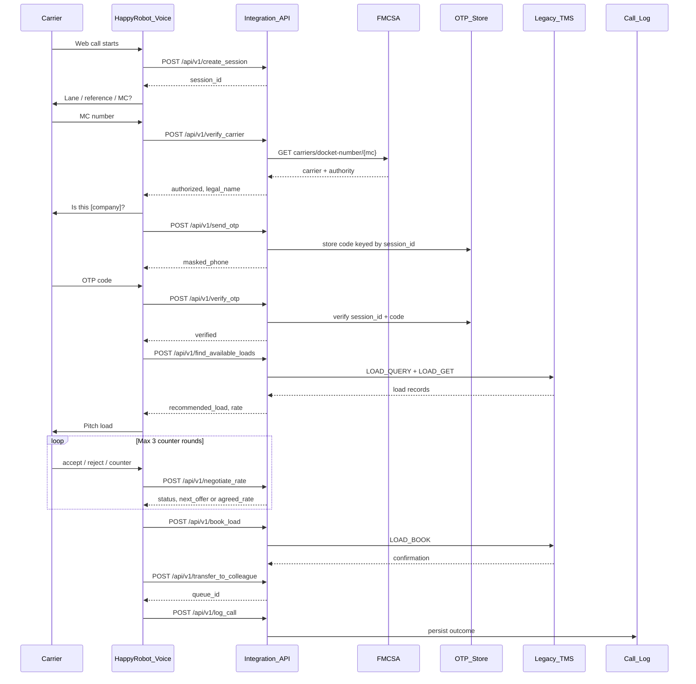
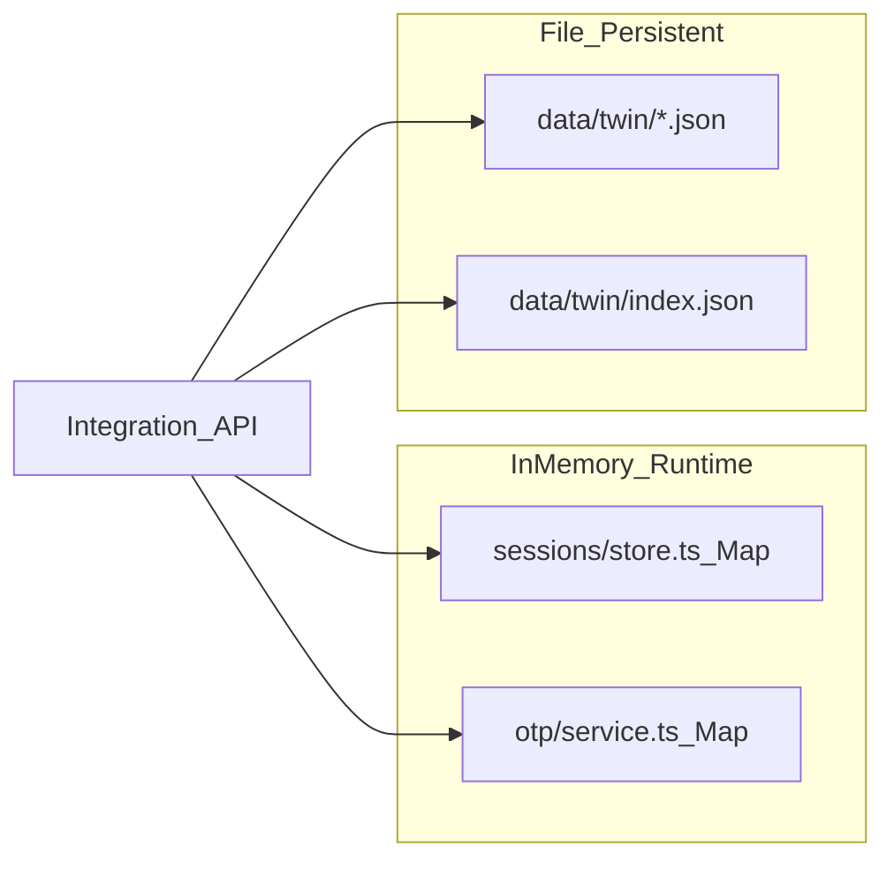
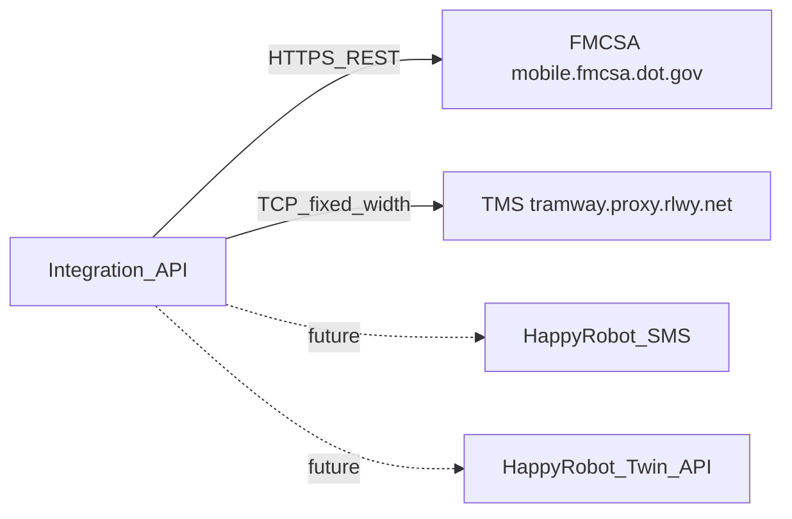
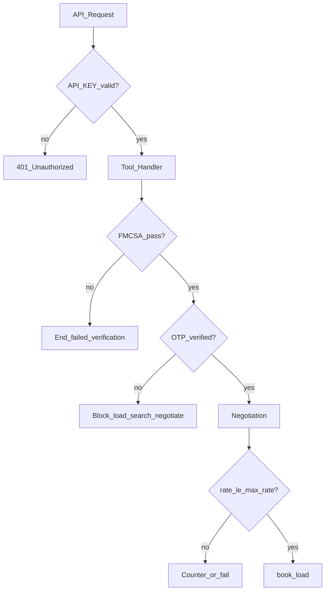
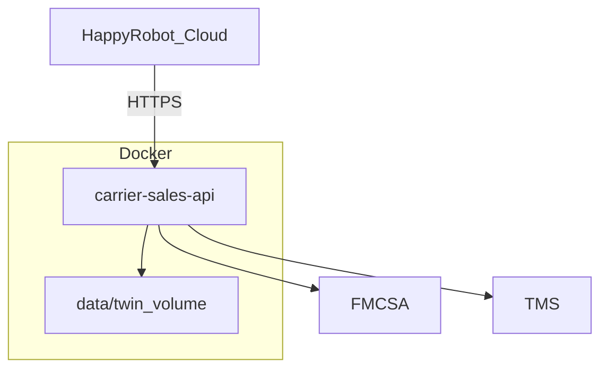
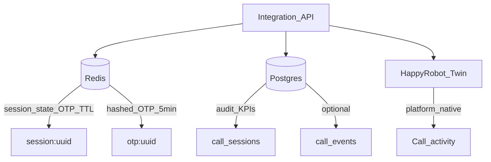

# HappyRobot Inbound Carrier Sales — Architecture

This document describes the system architecture for the FDE Technical Challenge POC and the recommended production evolution.

---

## System overview

HappyRobot handles the voice experience. A single **Integration API** proxies FMCSA, legacy TMS, OTP, negotiation policy, and call logging. The workflow uses **one base URL** and **one API key**.



---

## Call flow (sequence)



---

## Integration API (`/api/v1`)

Single entry point for HappyRobot tools. FMCSA and TMS credentials never leave the server.

| Tool | Method | Path | Backend |
|------|--------|------|---------|
| Catalog | GET | `/api/v1` | Lists all tools |
| `create_session` | POST | `/api/v1/create_session` | In-memory session |
| `verify_carrier` | POST | `/api/v1/verify_carrier` | FMCSA proxy |
| `lookup_carrier` | GET | `/api/v1/carriers/:mc_number` | FMCSA proxy (stateless) |
| `send_otp` | POST | `/api/v1/send_otp` | OTP store + SMS |
| `verify_otp` | POST | `/api/v1/verify_otp` | OTP verify |
| `find_available_loads` | POST | `/api/v1/find_available_loads` | TMS proxy |
| `get_load_detail` | GET | `/api/v1/loads/:load_id` | TMS proxy |
| `negotiate_rate` | POST | `/api/v1/negotiate_rate` | Policy engine |
| `book_load` | POST | `/api/v1/book_load` | TMS proxy |
| `transfer_to_colleague` | POST | `/api/v1/transfer_to_colleague` | Mock handoff |
| `log_call` | POST | `/api/v1/log_call` | Twin / log store |

**Auth:** `Authorization: Bearer <API_KEY>` or `X-API-Key: <API_KEY>`

Legacy kebab-case routes (`/verify-carrier`, `/search-loads`, etc.) remain as aliases.

---

## Data storage — POC (current)



| Store | Location | Keyed by | TTL / lifetime |
|-------|----------|----------|----------------|
| Call session | `src/sessions/store.ts` | `session_id` (UUID) | Until server restart |
| OTP | `src/otp/service.ts` | `session_id` | 300s default, max 3 attempts |
| Call log (Twin POC) | `data/twin/` JSON files | `call_id` | Persistent on disk |
| TMS read cache | `src/tms/cache.ts` | query key / `load_id` | 45s default |

### OTP matching (POC)

- One OTP record per `session_id`
- `send_otp` generates code → stored in memory under that session
- `verify_otp` compares code for the **same** `session_id`
- `find_available_loads` and `negotiate_rate` call `requireVerified(session_id)`
- Dev: code logged to server console `[OTP] session=... code=...`

### Session state (POC)

Each `session_id` holds: `carrier_mc`, `fmcsa_status`, `otp_status`, `loads_searched`, `load_offered`, `negotiation_rounds`, `agreed_rate`, `outcome`, `notes`, `handoff_queue_id`.

---

## External integrations



### FMCSA

- **Protocol:** HTTPS REST (QCMobile API)
- **Endpoint:** `GET /carriers/docket-number/{mc}?webKey=...`
- **Rule:** Active authority required (`common`, `contract`, or `broker` status `A`)
- **Proxied by:** `verify_carrier`, `lookup_carrier` — workflow never calls FMCSA directly

### Legacy TMS

- **Protocol:** TCP, line-based, `\r\n`, one request per connection
- **Commands:** `LOAD_QUERY`, `LOAD_GET`, `LOAD_BOOK`, `DEBUG_ECHO`
- **Resilience:** Retries, timeouts, 45s read cache, invalidate on book
- **Secrets:** `TMS_HOST`, `TMS_PORT`, `TMS_AUTH_TOKEN` (server env only)

---

## Security & policy



| Rule | Enforcement |
|------|-------------|
| API auth on all routes except `/health` | `authMiddleware` |
| FMCSA before OTP | `verify_carrier` gate |
| OTP before load search / negotiate | `otpService.requireVerified()` |
| Never expose `max_rate` | Stripped from carrier-facing responses |
| Max 3 negotiation rounds | `negotiation/engine.ts` |
| Fresh TMS check before book | `getLoad({ fresh: true })`, status `OPEN` |

---

## Deployment (POC)



```bash
cd backend
docker compose up --build
```

| Env var | Purpose |
|---------|---------|
| `API_KEY` | HappyRobot → API auth |
| `FMCSA_WEB_KEY` | FMCSA proxy (server only) |
| `TMS_HOST`, `TMS_PORT`, `TMS_AUTH_TOKEN` | TMS TCP (server only) |
| `TWIN_DATA_DIR` | Call log JSON path |
| `OTP_PHONE_OVERRIDE` | Dev fallback when FMCSA has no phone |

---

## Production evolution (not implemented in POC)

Recommended upgrade path when moving beyond POC:



| Concern | POC | Production |
|---------|-----|------------|
| Session state | In-memory `Map` | **Redis** (TTL 30–60 min) |
| OTP | In-memory plaintext | **Redis** + **hashed** code, TTL 5 min |
| Call logs | JSON files | **Postgres** + Twin sync |
| TMS cache | In-memory | Redis (optional) |
| SMS | Console log | HappyRobot SMS |
| Ops dashboard | HTML + `/ops/*` | HappyRobot Apps + Postgres |

### OTP production pattern

1. Generate code → hash → store in `otp:{session_id}` (Redis, TTL 300s)
2. Send plaintext only via SMS (never persist plaintext)
3. Verify: compare hash, increment attempts, lock after 3 failures

---

## Repository layout

```text
HappyRobots/
├── Architecture/          ← this folder
│   ├── ARCHITECTURE.md
│   └── diagrams.md
├── backend/               ← Integration API (Fastify + TypeScript)
│   ├── src/
│   │   ├── routes/        ← /api/v1 handlers
│   │   ├── tms/           ← TCP client + cache
│   │   ├── fmcsa/         ← FMCSA proxy client
│   │   ├── otp/           ← OTP service (in-memory POC)
│   │   ├── sessions/      ← Session store (in-memory POC)
│   │   ├── negotiation/   ← Rate policy engine
│   │   └── twin/          ← JSON log store (POC)
│   └── docker-compose.yml
├── workflow/
│   └── AGENT_PROMPT.md    ← Voice agent instructions + tool map
└── apps/
    └── ops-dashboard/     ← Ops UI (reads /ops/*)
```

---

## Related docs

- [backend/README.md](../backend/README.md) — API setup & run
- [workflow/AGENT_PROMPT.md](../workflow/AGENT_PROMPT.md) — Voice workflow & tools
- [docs/BUILD_DESCRIPTION.md](../docs/BUILD_DESCRIPTION.md) — Submission build description
- TMS protocol: [candidate handbook](https://fde-challenge-candidate-handbook-production.up.railway.app/spec/)
