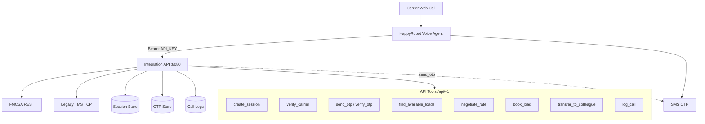
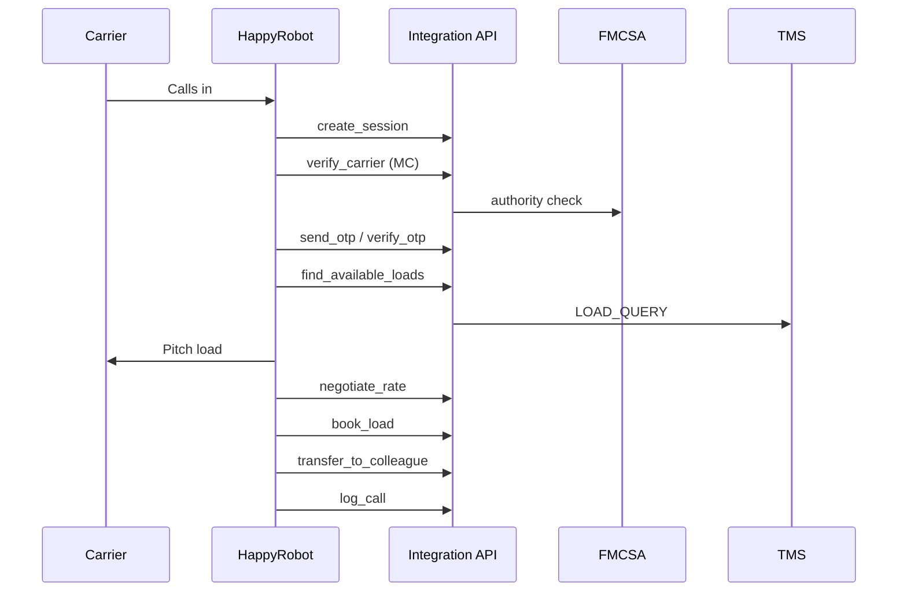
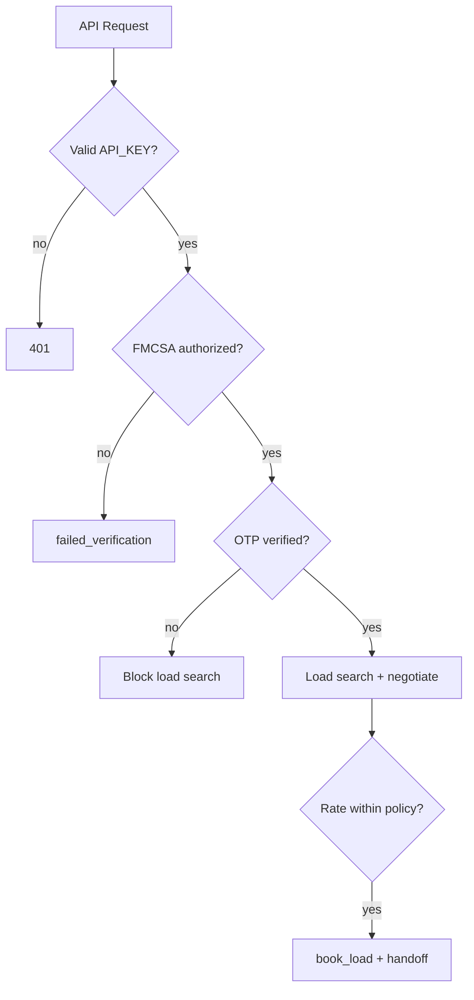

# Architecture

Inbound carrier sales POC: HappyRobot voice workflow → single Integration API → FMCSA, TMS, OTP, negotiation, and call logging.

## System diagram

## Call flow

## Security gates

## Docs

- [ARCHITECTURE.md](./ARCHITECTURE.md) — components, API table, POC vs production
- [../workflow/AGENT_PROMPT.md](../workflow/AGENT_PROMPT.md) — voice agent + tool mapping
- [../README.md](../README.md) — deploy instructions
