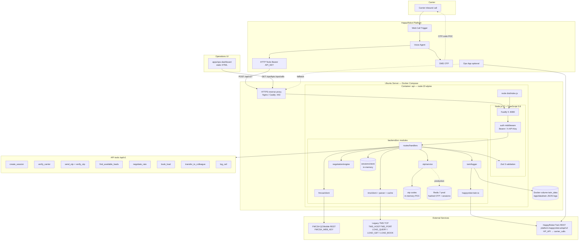
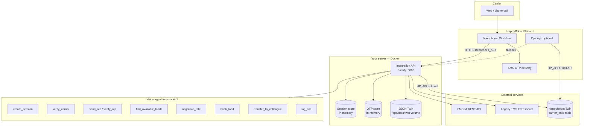
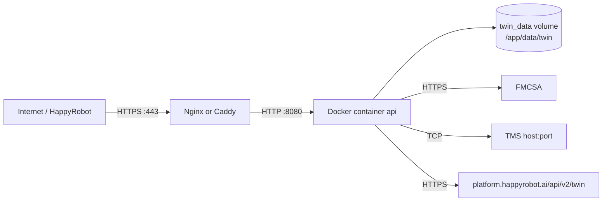
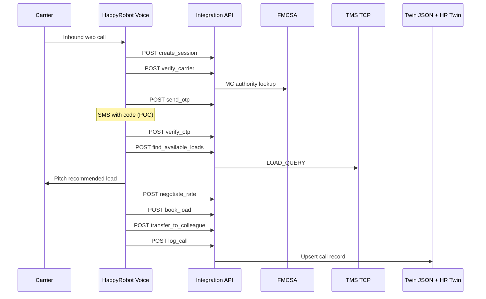
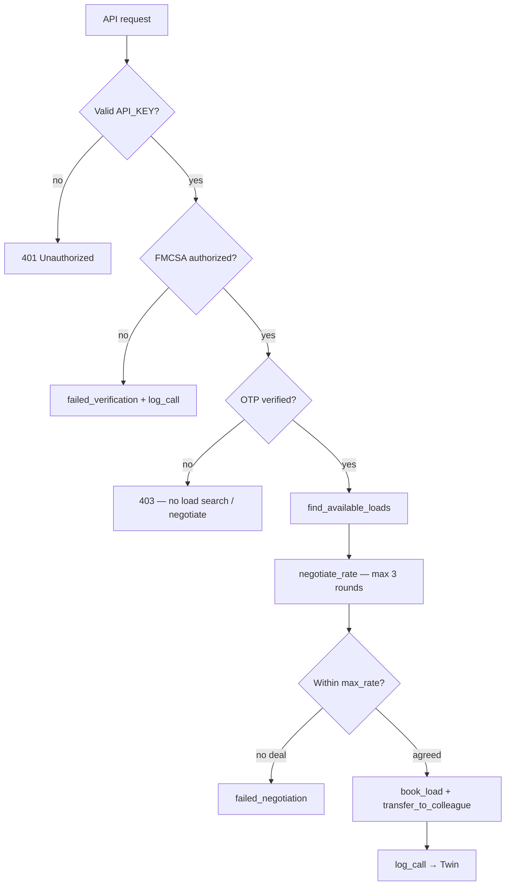
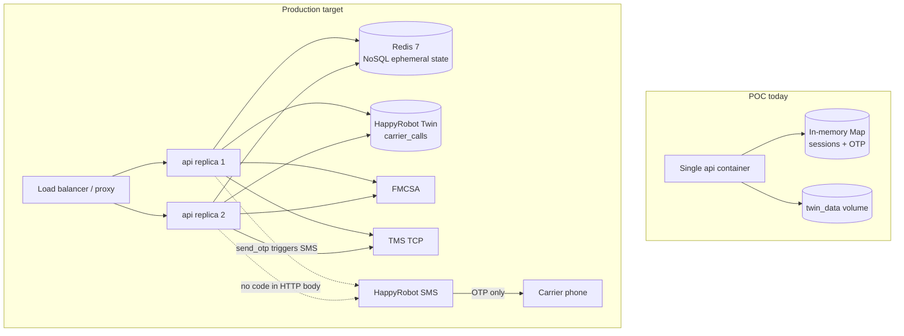

# Architecture

End-to-end architecture for the **Inbound Carrier Sales** FDE POC: a carrier calls via HappyRobot, the voice agent calls a single **Integration API**, and the API talks to FMCSA, a legacy TMS, OTP logic, negotiation policy, and call logging.

**Production example:** `https://happyapi.edhuntx.com`  
**Repo:** `backend/` is the only service you deploy with Docker.

---

## Full architecture (Mermaid)



---

## Technology stack

| Layer | Technology | Notes |
|-------|------------|-------|
| **Runtime** | Node.js **22** (Alpine in Docker) | ESM (`"type": "module"`) |
| **Language** | TypeScript **5.8** | Compiled to `dist/` via `tsc` |
| **HTTP server** | **Fastify 5** | JSON API, structured logging, empty-body fix for HappyRobot |
| **Validation** | **Zod 3** | Request bodies + env config; numeric coercion for negotiate rates |
| **Config** | **dotenv** | `backend/.env` (gitignored) |
| **Tests** | **Vitest 3** | Unit tests for TMS parser, negotiation, schemas, cache |
| **Dev server** | **tsx** | `npm run dev` with watch mode |
| **Container** | **Docker** multi-stage build | `node:22-alpine` build + production image |
| **Orchestration** | **Docker Compose v2** | Single `api` service, named volume for Twin JSON |
| **Voice / UX** | **HappyRobot** platform | Web call trigger, SMS OTP, HTTP tools, optional Apps UI |
| **Carrier authority** | **FMCSA QCMobile REST** | MC lookup via `FMCSA_WEB_KEY` |
| **Loads** | **Legacy TMS TCP** | Fixed-width line protocol (`LOAD_QUERY`, `LOAD_GET`, `LOAD_BOOK`) |
| **Call logging** | JSON files + **HappyRobot Context/Twin** | Dual-write when `HP_API` is set |
| **Ops UI** | Static HTML (`apps/ops-dashboard/`) | Fetches `/ops/kpis` and `/ops/calls` |

### NPM scripts (`backend/package.json`)

| Script | Command | Purpose |
|--------|---------|---------|
| `dev` | `tsx watch src/index.ts` | Local API on `:8080` |
| `build` | `tsc` | Compile TypeScript → `dist/` |
| `start` | `node dist/index.js` | Production entry (used in Docker) |
| `test` | `vitest run` | Unit tests |
| `twin:schema` | `node scripts/apply-twin-schema.mjs` | Create `carrier_calls` table in HappyRobot Twin |

---

## System diagram



HappyRobot only needs **one base URL** and **one API key** (`API_KEY`). FMCSA, TMS, and HappyRobot platform keys never go to the voice agent.

---

## Docker deployment



### Image (`backend/Dockerfile`)

1. **Build stage** — `node:22-alpine`, `npm install`, `npm run build` → `dist/`
2. **Runtime stage** — production deps only, `NODE_ENV=production`, exposes **8080**
3. **Volume** — `/app/data/twin` for persistent JSON call logs
4. **CMD** — `node dist/index.js`

### Compose (`backend/docker-compose.yml`)

| Setting | Value |
|---------|--------|
| Service name | `api` |
| Port map | `8080:8080` |
| Env | `env_file: .env` |
| Volume | `twin_data:/app/data/twin` |
| Restart | `unless-stopped` |
| Healthcheck | `GET http://127.0.0.1:8080/health` every 30s |

### Deploy commands

```bash
cd backend
cp .env.example .env    # fill API_KEY, TMS_*, FMCSA_*, optional HP_API
./deploy.sh             # docker compose up --build -d + health wait
# or
docker compose up --build -d
```

TLS termination (Certbot, Caddy, etc.) sits **in front** of the container; HappyRobot base URL is your public HTTPS domain.

---

## Backend module map (`backend/src/`)

```text
index.ts                 Fastify app, JSON parser, auth hook, /health
config.ts                Zod-validated environment variables
middleware/auth.ts       Bearer / X-API-Key → API_KEY
routes/
  api.ts                 Route registration + ops endpoints
  handlers.ts            Business logic per tool
sessions/store.ts        In-memory call session state
fmcsa/
  client.ts              FMCSA REST lookup
  mock-carriers.ts       Demo MC 999999 bypass for voice tests
otp/service.ts           Generate / verify OTP codes
tms/
  client.ts              TCP socket client with retries
  parser.ts              Fixed-width LOAD_* line protocol
  cache.ts               45s in-memory cache for LOAD_QUERY
negotiation/engine.ts    max_rate ceiling, 3-round cap
twin/
  logger.ts              JSON index + per-call files; triggers Twin sync
  happyrobot-twin.ts     Upsert to HappyRobot Twin REST API
  types.ts               TwinCallRecord shape
lib/
  schemas.ts             Zod request schemas (numeric coercion)
  errors.ts              AppError → HTTP status mapping
```

### Request path

1. HappyRobot POSTs to `/api/v1/<tool>` with `Authorization: Bearer <API_KEY>`
2. `authMiddleware` validates key (skipped for `/health`)
3. Handler loads/updates `CallSession` in memory
4. FMCSA / TMS / OTP / negotiation run server-side
5. `twinLogger.logSession()` writes JSON + optional Twin upsert

---

## External integrations

### FMCSA (REST)

- **Client:** `src/fmcsa/client.ts`
- **Endpoint:** `GET {FMCSA_BASE_URL}/carriers/docket-number/{mc}?webKey=...`
- **Checks:** active operating authority before OTP
- **Demo bypass:** MC `999999` uses `mock-carriers.ts` (authorized + fixed phone)

### Legacy TMS (TCP)

- **Client:** `src/tms/client.ts`
- **Transport:** TCP to `TMS_HOST:TMS_PORT` with `TMS_AUTH_TOKEN`
- **Commands:** `LOAD_QUERY` (search), `LOAD_GET` (detail + `MAX_BUY`), `LOAD_BOOK`
- **Resilience:** connect/read timeouts, up to `TMS_MAX_RETRIES` retries
- **Cache:** optional 45s TTL on search results (`TMS_CACHE_*`)

### OTP

- **Service:** `src/otp/service.ts` — 6-digit code, TTL, max attempts
- **POC SMS:** `send_otp` can return `code` + `registered_phone` when `OTP_RETURN_CODE_IN_RESPONSE=true` for HappyRobot SMS tools
- **Gate:** load search and negotiation blocked until `otp_status === verified`

### HappyRobot Context / Twin

- **When:** `HP_API` set and `HP_TWIN_SYNC=true`
- **API base:** `https://platform.happyrobot.ai/api/v2`
- **Table:** `carrier_calls` (schema in `backend/scripts/twin_schema_carrier_calls.sql`)
- **Write path:** `UPDATE … WHERE call_id` then `POST /twin/tables/carrier_calls/rows` on first insert
- **Read path (Apps):** `GET /twin/tables/carrier_calls` with same `HP_API`

---

## Call flow



Typical voice timeouts: **60s** for `find_available_loads` (TMS can take 5–10s).

---

## Security gates



**Server-enforced policy (never trust the LLM alone):**

- `max_rate` / `MAX_BUY` never returned in API responses to carriers
- OTP required before loads or negotiation
- Booking uses session `agreed_rate` only (`book_load` body: `{ session_id }`)
- Booking performs a fresh TMS status check before final confirmation
- Numeric strings coerced in `negotiate_rate` (`"2400"`, `"$2,400"` → number)

---

## API surface

All tools under `/api/v1/*`. Catalog: `GET /api/v1`.

| Tool | Method | Path |
|------|--------|------|
| `create_session` | POST | `/api/v1/create_session` |
| `verify_carrier` | POST | `/api/v1/verify_carrier` |
| `lookup_carrier` | GET | `/api/v1/carriers/:mc_number` |
| `send_otp` | POST | `/api/v1/send_otp` |
| `verify_otp` | POST | `/api/v1/verify_otp` |
| `find_available_loads` | POST | `/api/v1/find_available_loads` |
| `get_load_detail` | GET | `/api/v1/loads/:load_id` |
| `negotiate_rate` | POST | `/api/v1/negotiate_rate` |
| `book_load` | POST | `/api/v1/book_load` |
| `transfer_to_colleague` | POST | `/api/v1/transfer_to_colleague` |
| `log_call` | POST | `/api/v1/log_call` |
| Ops KPIs | GET | `/api/v1/ops/kpis` |
| Ops calls | GET | `/api/v1/ops/calls` |

**Auth:** `Authorization: Bearer <API_KEY>` or `X-API-Key: <API_KEY>`  
**Public:** `GET /health` only

---

## Environment variables

| Variable | Required | Purpose |
|----------|----------|---------|
| `API_KEY` | yes | HappyRobot → Integration API auth |
| `PORT` / `HOST` | no | Default `8080` / `0.0.0.0` |
| `TMS_HOST` / `TMS_PORT` / `TMS_AUTH_TOKEN` | yes | Legacy TMS TCP |
| `FMCSA_WEB_KEY` | yes | FMCSA QCMobile API |
| `OTP_*` | no | Length, TTL, max attempts |
| `TWIN_DATA_DIR` | no | JSON log directory (default `./data/twin`) |
| `HP_API` | no | HappyRobot platform key → Twin dual-write |
| `HP_BASE_URL` | no | Default `https://platform.happyrobot.ai/api/v2` |
| `HP_TWIN_TABLE` | no | Default `carrier_calls` |
| `HP_TWIN_SYNC` | no | `true` / `false` |
| `OTP_RETURN_CODE_IN_RESPONSE` | no | POC: expose OTP in `send_otp` JSON |
| `DEMO_MC_*` | no | Voice test carrier (MC `999999`) |

Template: `backend/.env.example`

---

## Storage model

| Data | POC (today) | Production recommendation |
|------|-------------|---------------------------|
| Call sessions | In-memory `Map` | **Redis** (TTL per session) |
| OTP codes | In-memory `Map` (plaintext in process) | **Redis** (hashed code, TTL, attempt counter) |
| TMS search cache | In-memory, 45s TTL | **Redis** (optional, same TTL keys) |
| Call logs (local) | JSON Docker volume | Remove — Twin only |
| Call logs (platform) | HappyRobot Twin `carrier_calls` | Twin + warehouse export |
| Secrets | `.env` on server | Docker secrets / vault; never in image |

Twin record fields: `call_id`, `carrier_mc`, `fmcsa_status`, `otp_status`, lane/equipment, load offered, negotiation rounds, `agreed_rate`, `outcome`, `notes[]`, handoff id, timestamps.

---

## Production data layer — Redis (NoSQL) recommendation

The POC keeps sessions and OTP in **process memory**. That is fine for a single-container demo but breaks down in production:

- **Restarts** wipe sessions mid-call
- **Horizontal scale** (multiple API replicas) cannot share OTP state
- **OTP codes** sit in plaintext in the Node heap (see `otp/service.ts` today)

**Recommendation:** add **Redis** as the production NoSQL store for ephemeral, security-sensitive state. Use HappyRobot Twin (or Postgres) only for durable call analytics — not live OTP secrets.

### What goes in Redis

| Key pattern | Value | TTL | Why Redis |
|-------------|-------|-----|-----------|
| `session:{session_id}` | JSON `CallSession` | ~2h | Survives restarts; shared across replicas |
| `otp:{session_id}` | hashed code + phone + attempts | `OTP_TTL_SECONDS` (e.g. 300s) | Auto-expire; no OTP in API JSON |
| `otp:attempts:{session_id}` | integer counter | same as OTP | Rate-limit brute force |
| `tms:cache:{hash}` | LOAD_QUERY result | 45s | Optional; reduces TMS load |

### Secure OTP in production

| POC (today) | Production |
|-------------|------------|
| OTP stored plaintext in `Map` | Store **HMAC-SHA256** of code + session salt in Redis |
| `OTP_RETURN_CODE_IN_RESPONSE=true` | **`false`** — code only via HappyRobot SMS |
| OTP logged to console / Docker logs | Never log codes; structured logs redact phone |
| Single Node process | Redis shared by all `api` replicas |
| `verify_otp` increments attempts in memory | `INCR` on Redis key; lock after `OTP_MAX_ATTEMPTS` |

Env changes for production:

```env
OTP_RETURN_CODE_IN_RESPONSE=false
REDIS_URL=redis://redis:6379
SESSION_TTL_SECONDS=7200
```

### Production deployment (Mermaid)



### Docker Compose sketch (production)

```yaml
services:
  api:
    build: .
    env_file: .env
    depends_on:
      redis:
        condition: service_healthy
    environment:
      REDIS_URL: redis://redis:6379
    deploy:
      replicas: 2   # example

  redis:
    image: redis:7-alpine
    command: redis-server --save "" --appendonly no   # ephemeral; no disk persistence for OTP
    healthcheck:
      test: ["CMD", "redis-cli", "ping"]
```

Implementation note: swap `sessions/store.ts` and `otp/service.ts` backends from `Map` to a Redis client (`ioredis` or `redis` npm package). Keep the same HTTP API contract — HappyRobot tools do not change.

---

## Repository layout

```text
HappyRobots/
├── backend/                    # Integration API — deploy with Docker
│   ├── Dockerfile              # node:22-alpine multi-stage
│   ├── docker-compose.yml
│   ├── deploy.sh
│   ├── src/                    # TypeScript source (see module map)
│   ├── scripts/                # Twin schema apply
│   ├── tests/                  # Vitest
│   └── .env.example
├── apps/
│   └── ops-dashboard/          # Static ops UI → /ops/*
├── Architecture/               # This folder
└── README.md                   # Quick deploy guide
```

---

## Operations surfaces

| Surface | How | Data source |
|---------|-----|-------------|
| **HappyRobot workflow** | HTTP tools → Integration API | Live session + TMS |
| **External ops dashboard** | Open `apps/ops-dashboard/index.html`, set API URL + key | `GET /ops/kpis`, `/ops/calls` |
| **HappyRobot App** | Bind to Twin table or ops API | `GET …/twin/tables/carrier_calls` or ops endpoints |
| **Docker logs** | `docker compose logs -f api` | OTP codes in POC when returned in response |

---

## Local development (no Docker)

```bash
cd backend
cp .env.example .env
npm install
npm run dev        # tsx watch, :8080
npm test           # vitest
npm run build && npm start   # production-like
```

---

## Related docs

- [../README.md](../README.md) — deploy checklist and troubleshooting
