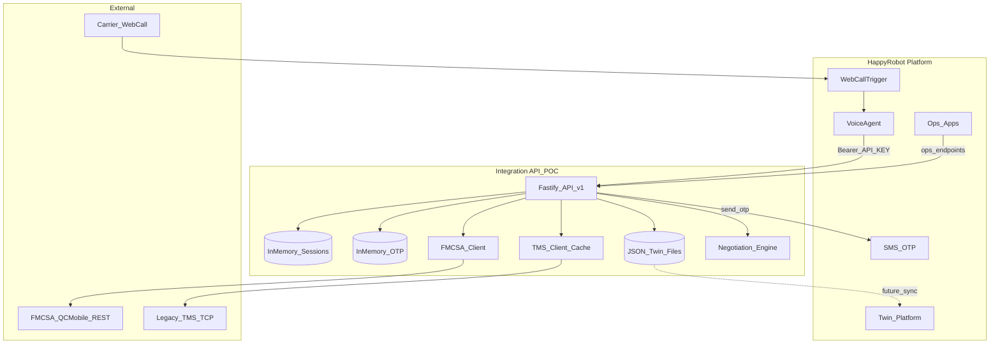
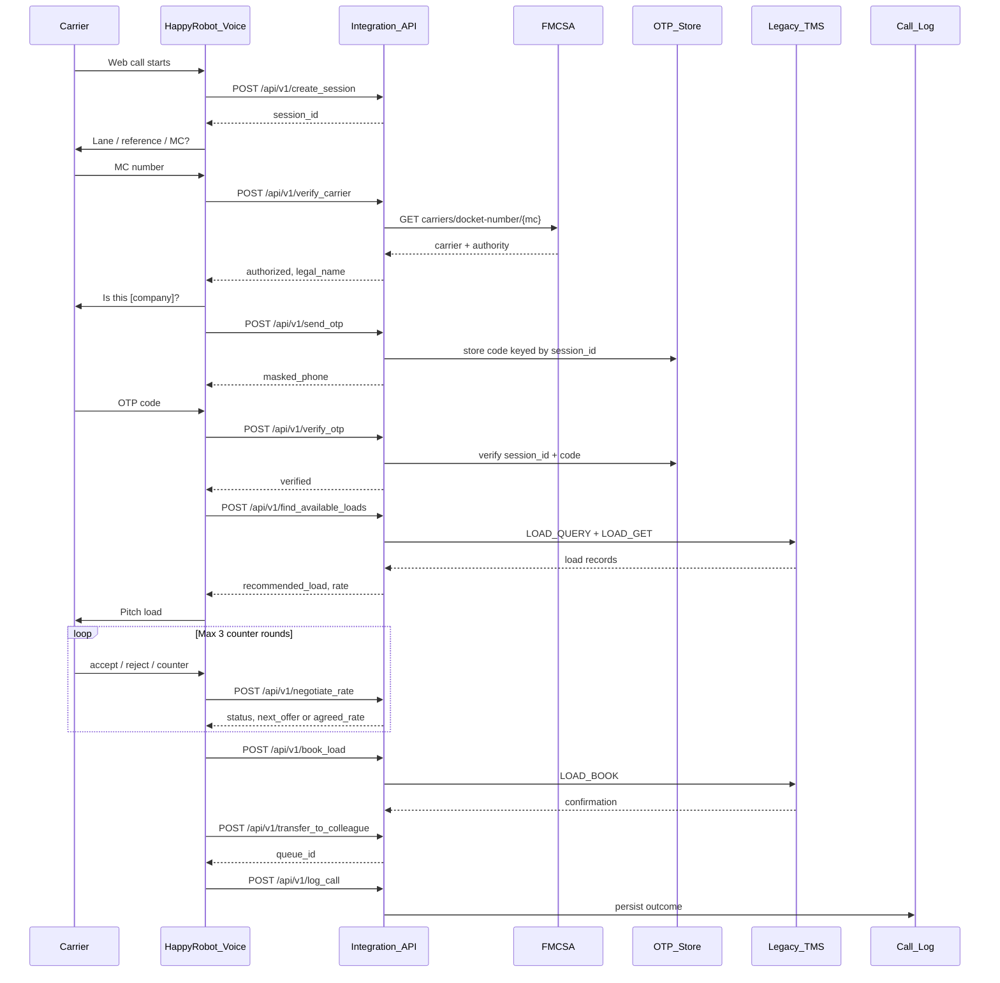
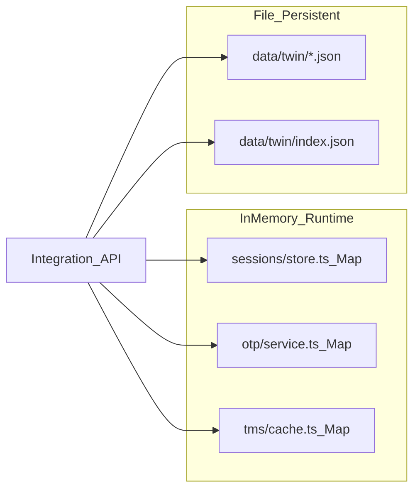
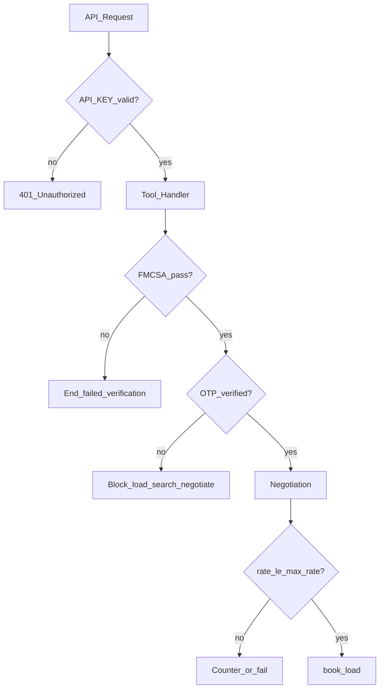
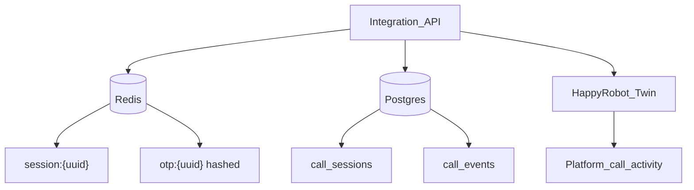
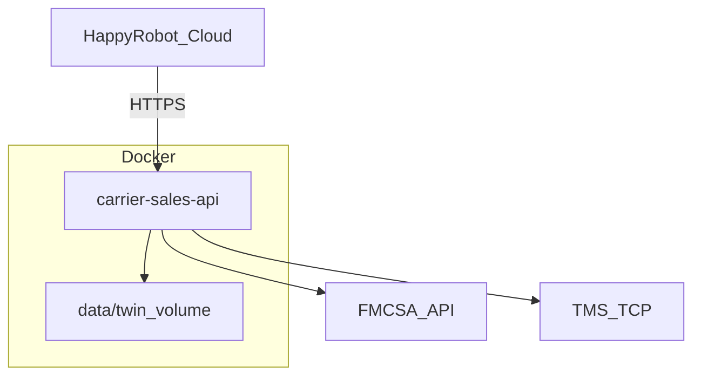

# Architecture diagrams

Standalone Mermaid diagrams for the Inbound Carrier Sales POC.  
Full narrative: [ARCHITECTURE.md](./ARCHITECTURE.md)

---

## 1. System context

---

## 2. Call sequence

---

## 3. POC data stores

---

## 4. Security gates

---

## 5. Production target (future)

---

## 6. Docker deployment

